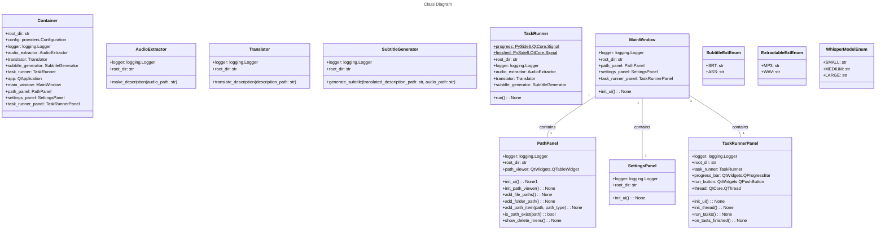

# Class Diagram

```mermaid
---
title: Class Diagram
---
classDiagram
    class Container {
        +root_dir: str
        +config: providers.Configuration
        +logger: logging.Logger
        
        %% services
        +audio_extractor: AudioExtractor
        +translator: Translator
        +subtitle_generator: SubtitleGenerator
        +task_runner: TaskRunner

        %% ui
        +app: QApplication
        +main_window: MainWindow
        +path_panel: PathPanel
        +settings_panel: SettingsPanel
        +task_runner_panel: TaskRunnerPanel
    }

    class AudioExtractor {
        +logger: logging.Logger
        +root_dir: str

        +make_description(audio_path: str)
    }

    class Translator {
        +logger: logging.Logger
        +root_dir: str

        +translate_description(description_path: str)
    }

    class SubtitleGenerator {
        +logger: logging.Logger
        +root_dir: str

        +generate_subtitle(translated_description_path: str, audio_path: str)
    }

    class TaskRunner {
        +progress: PySide6.QtCore.Signal$
        +finished: PySide6.QtCore.Signal$

        +root_dir: str
        +logger: logging.Logger
        +audio_extractor: AudioExtractor
        +translator: Translator
        +subtitle_generator: SubtitleGenerator

        +run(): None
    }

    class PathPanel {
        +logger: logging.Logger
        +root_dir: str
        +path_viewer: QtWidgets.QTableWidget
        
        +init_ui(): None1
        +init_path_viewer(): None
        +add_file_paths(): None
        +add_folder_path(): None
        +add_path_item(path, path_type): None
        +is_path_exist(path): bool
        +show_delete_menu(): None
    }

    class SettingsPanel {
        +logger: logging.Logger
        +root_dir: str

        +init_ui(): None
    }

    class TaskRunnerPanel {
        +logger: logging.Logger
        +root_dir: str
        +task_runner: TaskRunner
        +progress_bar: QtWidgets.QProgressBar
        +run_button: QtWidgets.QPushButton
        +thread: QtCore.QThread
        
        +init_ui(): None
        +init_thread(): None
        +run_tasks(): None

        +on_tasts_finished(): None
    }

    class MainWindow {
        +logger: logging.Logger
        +root_dir: str
        +path_panel: PathPanel
        +settings_panel: SettingsPanel
        +task_runner_panel: TaskRunnerPanel

        +init_ui(): None
    }

    class SubtitleExtEnum {
        +SRT: str
        +ASS: str
    }

    class ExtractableExtEnum {
        +MP3: str
        +WAV: str
    }

    class WhisperModelEnum {
        +SMALL: str
        +MEDIUM: str
        +LARGE: str
    }

    MainWindow "1" -- "1" PathPanel: contains
    MainWindow "1" -- "1" SettingsPanel: contains
    MainWindow "1" -- "1" TaskRunnerPanel: contains
```
