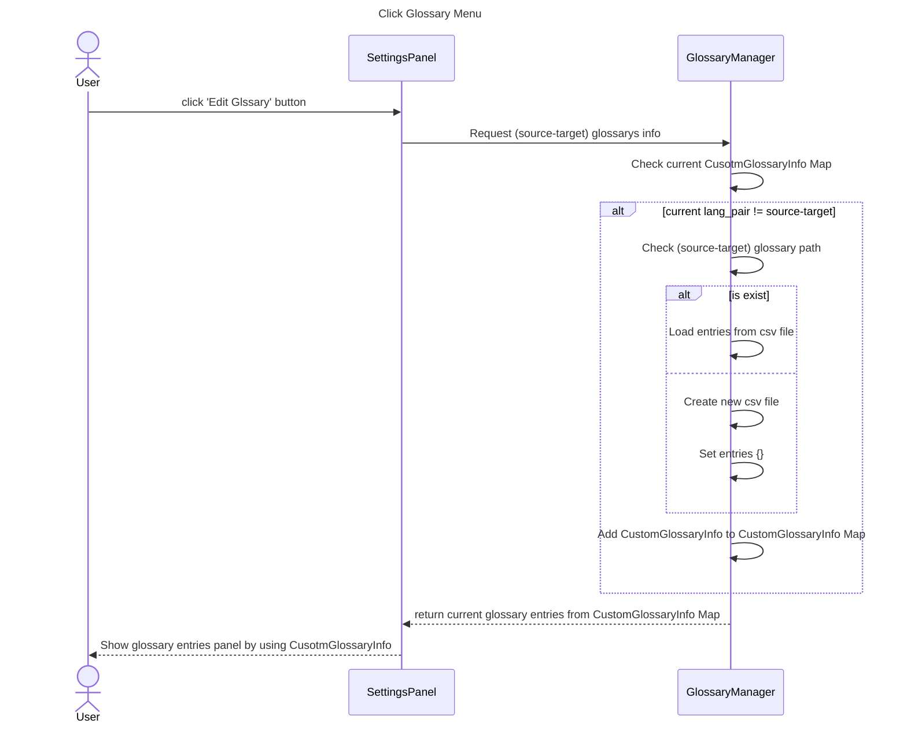
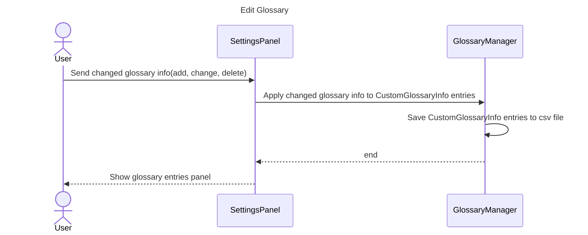
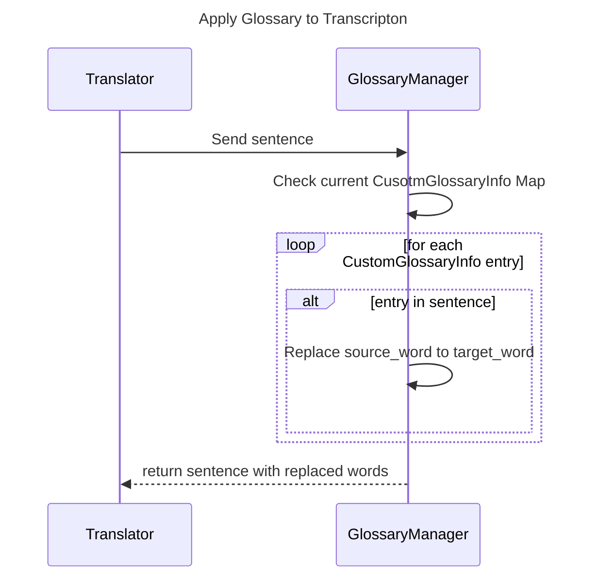

# Glossary

## Click Edit Glossary Menu

```mermaid
---
title: Click Glossary Menu
---
sequenceDiagram
    actor User
    participant SettingsPanel
    participant GlossaryManager

    User ->> SettingsPanel: click 'Edit Glssary' button
    SettingsPanel ->> GlossaryManager: Request (source-target) glossarys info
    GlossaryManager ->> GlossaryManager: Check current CusotmGlossaryInfo Map

    alt current lang_pair != source-target
        GlossaryManager ->> GlossaryManager: Check (source-target) glossary path
        alt is exist
            GlossaryManager ->> GlossaryManager: Load entries from csv file
        else
            GlossaryManager ->> GlossaryManager: Create new csv file
            GlossaryManager ->> GlossaryManager: Set entries {}
        end    
        GlossaryManager ->> GlossaryManager: Add CustomGlossaryInfo to CustomGlossaryInfo Map
    end
    GlossaryManager -->> SettingsPanel: return current glossary entries from CustomGlossaryInfo Map
    SettingsPanel -->> User: Show glossary entries panel by using CusotmGlossaryInfo
```

## Edit Glossary Entry

```mermaid
---
title: Edit Glossary 
---
sequenceDiagram
    actor User
    participant SettingsPanel
    participant GlossaryManager

    User ->> SettingsPanel: Send changed glossary info(add, change, delete)
    SettingsPanel ->> GlossaryManager: Apply changed glossary info to CustomGlossaryInfo entries
    GlossaryManager ->> GlossaryManager: Save CustomGlossaryInfo entries to csv file
    GlossaryManager -->> SettingsPanel: end
    SettingsPanel -->> User: Show glossary entries panel
```

## Apply Glossary to Transcripton

```mermaid
---
title: Apply Glossary to Transcripton
---
sequenceDiagram
    participant Translator
    participant GlossaryManager

    Translator ->> GlossaryManager: Send sentence
    GlossaryManager ->> GlossaryManager: Check current CusotmGlossaryInfo Map
    loop for each CustomGlossaryInfo entry
        alt entry in sentence
            GlossaryManager ->> GlossaryManager: Replace source_word to target_word
        end
    end
    GlossaryManager -->> Translator: return sentence with replaced words
```
